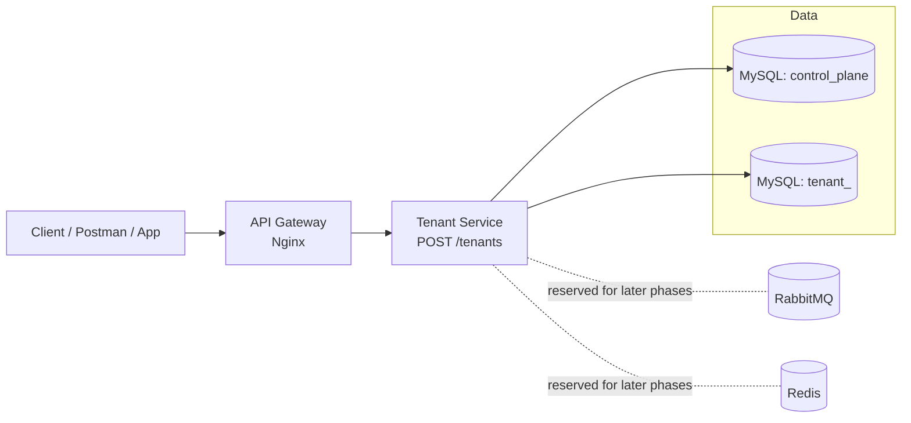
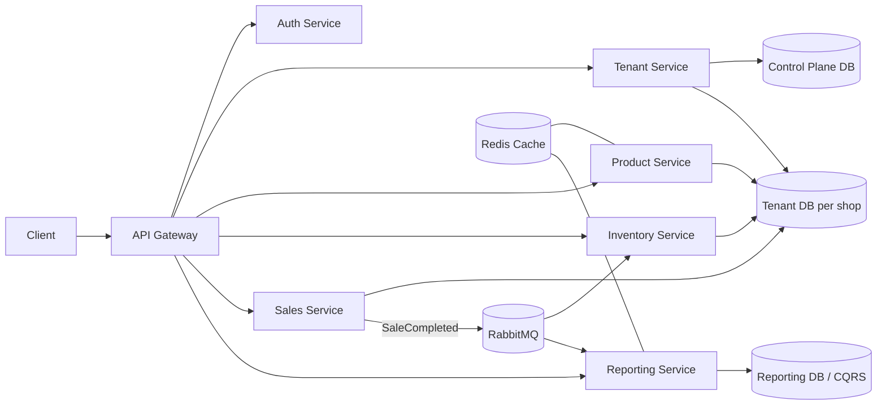
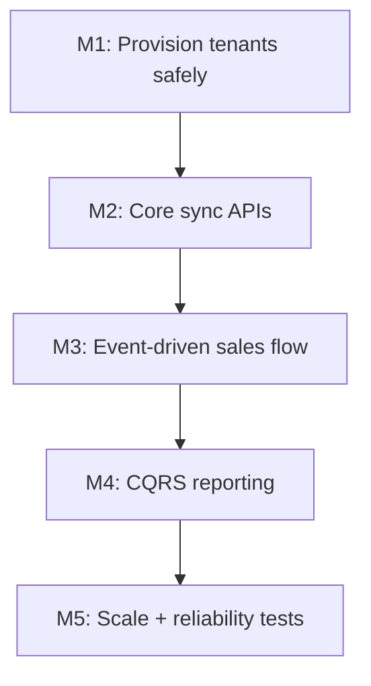
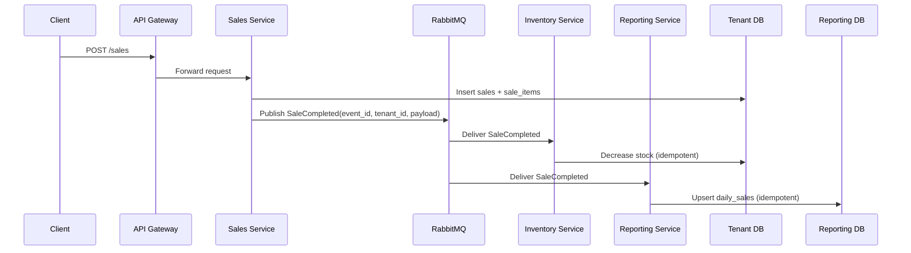

# POS SaaS Project Diagram

Use this file as your north-star map while building.

## 1) Current State (Phase 1)

## 2) Target End-State (Phase 6 Vision)

## 3) What You Are Actually Building

## 4) Core Event Flow (Sales)

## 5) Mental Model

- Tenant Service controls onboarding and database-per-tenant lifecycle.
- Business writes happen in tenant DBs (products, inventory, sales).
- RabbitMQ moves domain events between services asynchronously.
- Reporting service builds read-optimized aggregates (CQRS).
- API Gateway is the single entry point for clients.
